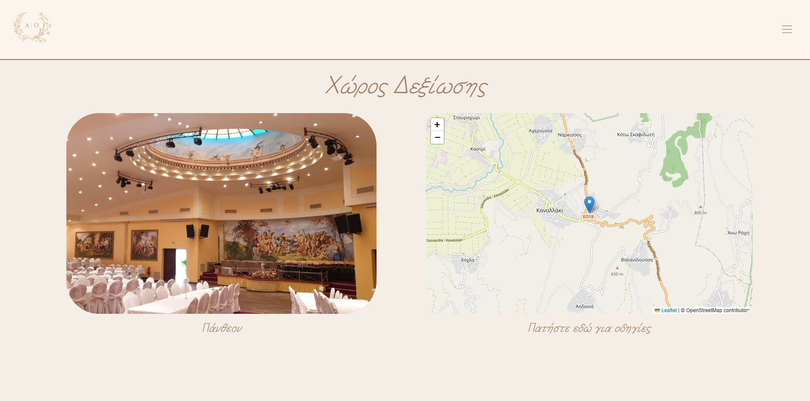

This project is a digital single-page wedding invitation designed to share key details such as the ceremony time, church location, venue information, photos, and maps. Built with HTML, CSS, Bootstrap, and JavaScript, it is optimized primarily for mobile devices but remains fully responsive across larger screens as well.

### Demonstration rendered on mobile screen:

### Rendered on a PC monitor:

 